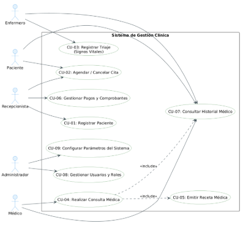
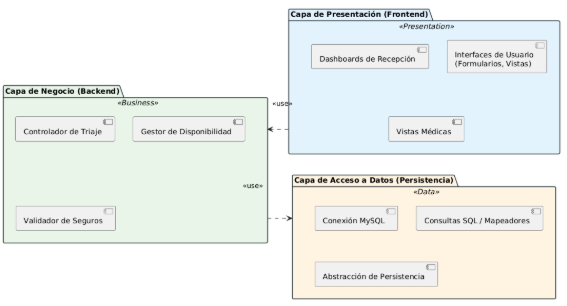
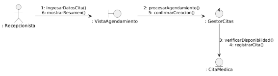
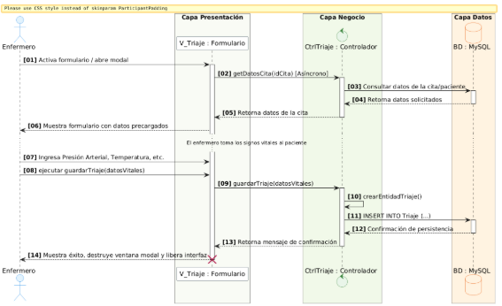
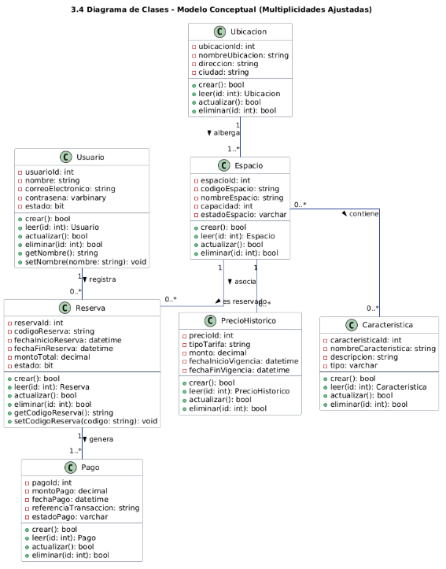
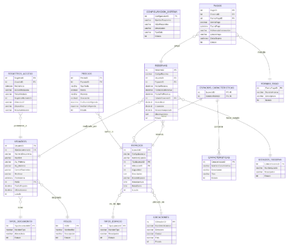
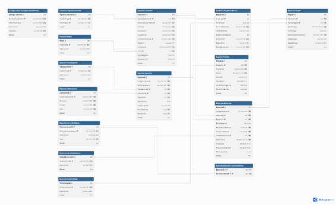
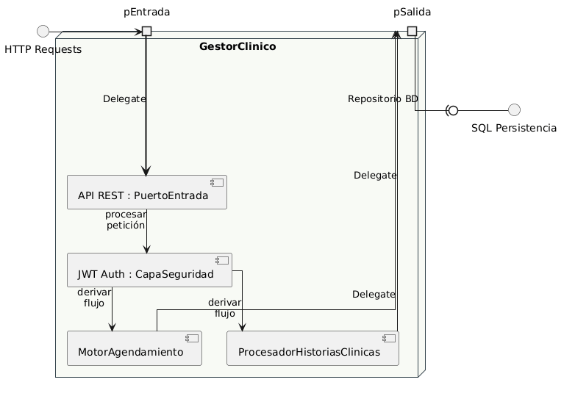
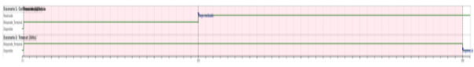
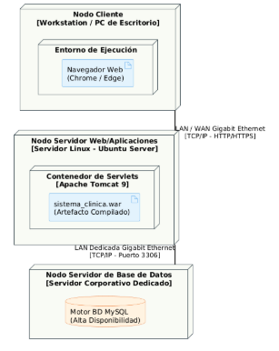

**UNIVERSIDAD TECNOLÓGICA DEL PERÚ**

**Proyecto Final** 

Docente:

ELVIS WILSON ALCANTARA PINEDO

**Facultad de Ingeniería**

Curso:

**Análisis y Diseño de Sistemas de Información**

Integrante*s:*

Collantes Meza, Jhunior – U23300239

LIMA – JUNIO 2026
# índice
[**DESCRIPCIÓN DE LA EMPRESA**	4](#_toc231244032)

[**MISIÓN Y VISIÓN**	4](#_toc231244033)

[**Misión**	4](#_toc231244034)

[**Visión**	4](#_toc231244035)

[**JUSTIFICACIÓN**	4](#_toc231244036)

[**OBJETIVOS GENERALES Y ESPECÍFICOS**	5](#_toc231244037)

[**Objetivo General**	5](#_toc231244038)

[**Objetivos Específicos**	5](#_toc231244039)

[**ASPECTOS DE LA ORGANIZACIÓN**	6](#_toc231244040)

[**1. ÁMBITO DEL PROYECTO**	7](#_toc231244041)

[**1.1 Área (donde se va a aplicar el Proyecto)**	7](#_toc231244042)

[**1.2 Recursos Humanos para la elaboración del Proyecto**	7](#_toc231244043)

[**1.3 Software (Necesario para el Proyecto)**	8](#_toc231244044)

[**1.4 Hardware (Necesario para el Proyecto)**	9](#_toc231244045)

[**1.5 Cronograma de Actividades**	9](#_toc231244046)

[**2. FASE DE INICIO**	11](#_toc231244047)

[**2.1 Modelado del Negocio**	11](#_toc231244048)

[**2.1.1 Modelado del Proceso de Negocio**	12](#_toc231244049)

[**2.1.2 Modelo de Análisis del Negocio**	12](#_toc231244050)

[**2.1.3 Recopilación de los Requerimientos (Entrevista, Cuestionario, Observación)**	13](#_toc231244051)

[**2.2 Matriz de Requerimientos**	15](#_toc231244052)

[**3. FASE DE ELABORACIÓN**	18](#_toc231244053)

[**3.1 Casos de Usos**	18](#_toc231244054)

[**3.1.1 Diagrama General de Casos de Uso**	19](#_toc231244055)

[**3.2 Especificaciones del Caso de Uso**	20](#_toc231244056)

[**3.3 Análisis del Sistema**	21](#_toc231244057)

[**3.3.1 Paquete de Análisis**	21](#_toc231244058)

[**3.3.4 Diagrama de comunicación**	22](#_toc231244059)

[**3.3.5 Diagrama de secuencia**	23](#_toc231244060)

[**3.4 Modelo conceptual o Diagrama de clase**	23](#_toc231244061)

[**3.5 Modelo Lógico**	24](#_toc231244062)

[**3.6 Modelo Físico**	25](#_toc231244063)

[**3.7 Tarjeta CRC de cada clase (APF2)**	26](#_toc231244064)

[**3.8 Diseño del Sistema**	26](#_toc231244065)

[**3.8.1 Patrón de diseño**	26](#_toc231244066)

[**3.8.2 Diagrama de estructura compuesta**	27](#_toc231244067)

[**3.8.4 Diagrama de despliegue**	28](#_toc231244068)

[**3.8.5 Diagrama de componentes (APF3)**	29](#_toc231244069)

[**3.9 Aplicativo**	30](#_toc231244069)

[**3.9.1 Captura de Pantallazos del Software (Principales)**	30](#_toc231244069)

[**3.9.2 Descripción de Cómo se Implementará al Usuario Final**	31](#_toc231244069)

[**3.9.3 Pruebas (Tipos) – Formatos de Validación**	32](#_toc231244069)

[**CONCLUSIONES**	34](#_toc231244069)

[**RECOMENDACIONES**	35](#_toc231244070)

[**BIBLIOGRAFÍA**	37](#_toc231244071)

# **DESCRIPCIÓN DE LA EMPRESA**
InnovaSpace Solutions S.A.C. es una organización tecnológica dedicada al desarrollo, implementación y comercialización de soluciones integrales de software para la optimización de recursos físicos e inmobiliarios. Fundada con el propósito de resolver las ineficiencias en la administración de áreas compartidas, la empresa provee una plataforma SaaS (Software as a Service) especializada en la automatización del ciclo completo de reservas, facturación, auditoría y control de aforo para espacios corporativos, comerciales, educativos y recreativos.

La organización opera bajo un modelo de innovación continua, integrando arquitecturas de software robustas basadas en el patrón de capas, lo que garantiza una alta disponibilidad, seguridad criptográfica en el manejo de credenciales de acceso y una escalabilidad modular para adecuarse a las necesidades de microempresas hasta grandes corporaciones multinacionales**.**
# **MISIÓN Y VISIÓN**
## **Misión**
Proveer soluciones tecnológicas avanzadas, intuitivas y seguras para la gestión eficiente de espacios físicos, transformando la experiencia operativa de los administradores y optimizando el tiempo de los usuarios finales mediante la automatización de procesos transaccionales y de control.
## **Visión**
Ser reconocidos para el año 2030 como la plataforma líder en América Latina en la gestión e inteligencia de espacios compartidos, destacando por la robustez de nuestra arquitectura de software, la excelencia operativa y nuestra capacidad para adaptarnos a los entornos de trabajo híbridos y dinámicos del futuro.
# **JUSTIFICACIÓN**
En el contexto empresarial moderno, la gestión manual o descentralizada de los recursos físicos (salas de reuniones, oficinas compartidas, almacenes, áreas recreativas) genera un conjunto crítico de problemas operativos. Entre ellos destacan la duplicidad de reservas, la subutilización de la capacidad instalada, la falta de transparencia en las tarifas y métodos de pago, y la ausencia absoluta de registros de auditoría que mitiguen riesgos de seguridad. La implementación de la Plataforma InnovaSpace se justifica bajo tres ejes fundamentales:

- Justificación Operativa y de Control: Centraliza toda la infraestructura en un inventario lógico estructurado por sedes y características, permitiendo un control de disponibilidad en tiempo real y eliminando por completo los errores humanos de sobre-reserva.
- Justificación Financiera: Al integrar un módulo flexible de precios históricos por vigencias y múltiples formas de pago, el sistema permite maximizar el retorno de inversión (ROI) de los activos físicos inmobiliarios, adaptando las tarifas de forma dinámica según la demanda o el tipo de cliente.
- Justificación Tecnológica y de Seguridad: La incorporación de un esquema de auditoría automatizado y el cifrado de datos sensibles asegura el cumplimiento de normativas de protección de información, brindando tranquilidad jurídica y operativa a la organización.

# **OBJETIVOS GENERALES Y ESPECÍFICOS**
## **Objetivo General**
Desarrollar e implementar un sistema integral de gestión de reservas y automatización de espacios físicos que optimice los procesos de asignación, tarifas y facturación, garantizando la integridad de los datos mediante una arquitectura de software modular y segura de tres capas.
## **Objetivos Específicos**
- Automatizar el proceso de reserva y pago de espacios en línea, reduciendo el tiempo de procesamiento de solicitudes en un 80% con respecto a los métodos tradicionales.
- Garantizar la consistencia de los datos de inventario mediante la normalización del modelo relacional hasta la tercera forma normal (3FN), mitigando la redundancia informativa.
- Implementar un módulo estricto de auditoría interna que registre el 100% de las acciones críticas de acceso, modificaciones de parámetros y transacciones financieras ejecutadas por los usuarios.
- Proveer flexibilidad comercial mediante un submódulo de precios dinámicos capaz de gestionar tarifas diferenciadas basadas en vigencias temporales y características específicas de los ambientes.
# **ASPECTOS DE LA ORGANIZACIÓN**
La estructura organizacional diseñada para interactuar con el sistema de software distribuye las responsabilidades en función de los roles definidos en la arquitectura lógica del negocio, asegurando que cada estamento posea un nivel de acceso estrictamente necesario (Principio de Menor Privilegio).

|**Rol Organizacional**|**Responsabilidades Principales**|**Interacción Directa con el Sistema** |
| :- | :- | :- |
|**Administrador del Sistema**|Gestión global de la plataforma, configuración de variables de entorno, control de políticas de seguridad y asignación de roles de usuario.|Módulo de Configuración, ABAC/RBAC en el esquema de Usuarios y visualización completa de los Registros de Acceso.|
|**Gerente de Operaciones / Comercial**|Supervisión del rendimiento comercial de los espacios, diseño de estrategias de precios, ofertas, descuentos y alta de nuevas sedes.|Módulo de Espacios, gestión de tablas de Precios, asignación de Características y control del catálogo de Ubicaciones.|
|**Personal de Recepción / Admisión**|Atención directa al cliente presencial o telefónico, registro de clientes nuevos, agendamiento de reservas de contingencia y verificación de pagos.|Interfaz de Reservas, procesamiento de Pagos y consulta de estados de disponibilidad de Espacios.|
|**Usuario Final / Cliente**|Uso personal o corporativo de la plataforma de cara al cliente, autogestión de sus reservas y carga segura de datos de facturación.|Portal web de Reservas, visualización de su propio Historial, pasarela de Pagos y gestión de su perfil de Usuario.|

# **1. ÁMBITO DEL PROYECTO**
## **1.1 Área (donde se va a aplicar el Proyecto)**
El presente proyecto de desarrollo e implementación tecnológica está enfocado en optimizar el área de **Sistemas y Tecnologías de la Información**, con aplicación directa y transversal sobre las áreas de **Admisión, Citas Médicas, Consultorios Externos y Diagnóstico por Imágenes** de la clínica Trinidad & Especialidades Médicas S.A.C. Esta prestigiosa institución de salud se encuentra ubicada estratégicamente en el Pasaje Las Mesetas N° 112, en la ciudad de Tarapoto, región San Martín.

La modernización abarcará la gestión integral de los pacientes, desde que realizan su solicitud de cita hasta la emisión de sus resultados médicos y recetas, buscando digitalizar el 100% de los procesos administrativos y asistenciales para garantizar un flujo de atención eficiente.
## **1.2 Recursos Humanos para la elaboración del Proyecto**
La magnitud y rigor técnico de este proyecto demanda un equipo de profesionales calificados, tanto del lado del desarrollo tecnológico como del lado del cliente y usuarios finales. El equipo base se compone de los siguientes perfiles:

- **Analista y Diseñador de Sistemas:** Rol liderado por Jhunior Collantes Meza. Responsable del levantamiento de información, diagramación de procesos (BPMN, IDEF0, UML), arquitectura del software y supervisión del ciclo de vida del desarrollo.
- **Desarrolladores de Software:** Ingenieros enfocados en la codificación del sistema, responsables de construir los módulos web interactivos, gestionar las conexiones de red y desarrollar la lógica de negocio requerida por el área médica.
- **Administrador de Base de Datos (DBA):** Especialista encargado del diseño del modelo lógico y físico de datos, asegurando la integridad, confidencialidad y alta disponibilidad de los historiales clínicos de los pacientes.
- **Usuarios Clave (Stakeholders):** Participación fundamental del personal administrativo (recepcionistas, gerencia) y del personal asistencial (médicos especialistas y tecnólogos médicos), quienes validarán la usabilidad y exactitud de los flujos de trabajo implementados.
## **1.3 Software (Necesario para el Proyecto)**
El ecosistema de software debe ser robusto y altamente seguro, considerando que se manejará información sensible de los pacientes. A continuación, se detalla el stack tecnológico requerido:

|**Categoría de Software**|
**Tecnologías y Herramientas Especificadas**

 
|
| :- | :- |
|**Desarrollo Backend y Frontend**|Sistema web integral estructurado con Java y el framework Spring Boot para la lógica empresarial. Interfaces web responsivas utilizando HTML5, CSS3 y JavaScript moderno.|
|**Base de Datos y Almacenamiento**|Motor de base de datos relacional SQL Server para la centralización y seguridad de datos clínicos, pacientes y agendas médicas.|
|**Sistemas Operativos**|Sistemas y entornos basados en distribuciones de Linux para la configuración de los servidores, garantizando la estabilidad y fluidez en la administración remota de comandos, gestión eficiente de directorios y control de rendimiento en tiempo real.|
|**Software de Especialidad Médica**|Herramientas de gestión de imágenes bajo el estándar DICOM/PACS, necesarias para integrar los exámenes de los tomógrafos y resonadores a la historia clínica electrónica.|
|**Herramientas de Apoyo al Desarrollo**|Implementación de asistentes de inteligencia artificial, como GitHub Copilot, para optimizar la escritura de código, revisión de sintaxis y el desarrollo de componentes del software.|

## **1.4 Hardware (Necesario para el Proyecto)**
La infraestructura física debe soportar tanto las etapas de programación y prueba, como la carga transaccional del sistema operando en tiempo real en la clínica.

|**Tipo de Hardware**|
**Requerimientos y Especificaciones Técnicas**

 
|
| :- | :- |
|**Equipos de Desarrollo (Workstations)**|Laptops orientadas al alto rendimiento y la computación intensiva para el equipo de desarrollo, como la línea MSI Katana o la serie Lenovo LOQ. Se requerirá que integren procesadores avanzados (por ejemplo, Intel Core i5-12400F) y tarjetas gráficas dedicadas (como la RTX 3050) para agilizar las tareas de compilación de código, pruebas de estrés y virtualización de bases de datos.|
|**Equipos de Despliegue Local (Clínica)**|Estaciones de trabajo de escritorio para el personal administrativo y médico, equipadas con procesadores Core i5 o Core i7 y pantallas de buena resolución. Adicionalmente, se requerirán servidores locales de alta disponibilidad diseñados para el procesamiento continuo y el almacenamiento local masivo requerido para imágenes de diagnóstico médico.|
|**Hardware Médico Integrado**|Equipamiento biomédico preexistente que debe conectarse e interactuar con el nuevo sistema, destacando el Resonador Magnético, el Tomógrafo Multicortes y las unidades de Rayos X Digital.|

## **1.5 Cronograma de Actividades**
Para garantizar el control, la calidad y la entrega oportuna, el proyecto se ha planificado minuciosamente para ejecutarse durante un periodo continuo de 16 semanas, abordando cada fase del ciclo de vida del software con hitos de evaluación claros:

|**Fases y Actividades Principales**|**Semanas 1 - 4**|**Semanas 5 - 8**|**Semanas 9 - 12**|
**Semanas 13 - 16**

 
|
| :- | :- | :- | :- | :- |
|**Análisis y Modelado:** Recopilación de información, análisis de requerimientos con usuarios, documentación funcional (BPMN AS-IS) y diseño estructurado de procesos (TO-BE).|Ejecución||||
|**Diseño Estructural e Interfaz:** Modelado detallado de Base de Datos (lógico y físico), estructuración de la arquitectura de la aplicación y maquetación de prototipos UI/UX para validación médica.||Ejecución|||
|**Desarrollo de Módulos Core:** Codificación e integración de los Módulos de Admisión, Gestión de Citas, Historias Clínicas Electrónicas, Agenda de Médicos/Horarios y Generador de Reportes Gerenciales.|||Ejecución||
|**Despliegue y Entrega:** Integración final de componentes, pruebas de validación, despliegue en clínica, capacitación técnica a usuarios, elaboración de documentación final y exposición del proyecto ante stakeholders.||||Ejecución|

# **2. FASE DE INICIO**
La fase de inicio representa el fundamento estratégico y analítico para el proyecto de modernización del sistema de información clínica y administrativa. En esta etapa, se establece el alcance detallado, se comprenden a profundidad las dinámicas operativas actuales de la institución y se identifican con precisión las necesidades de los usuarios y de la organización. El objetivo central es sentar bases sólidas que garanticen el desarrollo de una solución de software alineada con los objetivos de eficiencia, seguridad y calidad en la atención al paciente.

## **2.1 Modelado del Negocio**
El modelado del negocio permite abstraer y visualizar cómo opera actualmente la institución médica, facilitando la identificación de cuellos de botella, redundancias y oportunidades de mejora tecnológica. Trinidad & Especialidades Médicas SAC es una organización compleja que funciona ininterrumpidamente las 24 horas del día, prestando servicios como hospital y clínica ambulatoria, lo que exige un modelo de negocio altamente dinámico y sincronizado.

### **2.1.1 Modelado del Proceso de Negocio**
El modelado del proceso de negocio describe la secuencia lógica de actividades (flujos de trabajo) que la clínica ejecuta para entregar valor a sus pacientes. Para este proyecto, se han identificado y modelado los procesos "Core" o principales que serán impactados por el nuevo sistema:

- **Proceso de Admisión y Triaje:** Inicia cuando el paciente ingresa a las instalaciones ubicadas en el Psje. Las Mesetas 112, Tarapoto. Involucra el registro de datos demográficos, la validación de seguros o pagos, y la toma de signos vitales preliminares. Actualmente, este proceso presenta demoras debido al registro manual y la búsqueda física de fichas.
- **Proceso de Gestión de Citas Médicas:** Abarca la solicitud de atención por parte del paciente (vía telefónica, presencial o web), la verificación de disponibilidad de los especialistas (en áreas como Ginecología, Cardiología, Neurología, Oftalmología y Neurocirugía), la separación del cupo y la confirmación final. El modelado TO-BE (futuro) propone la automatización total de este proceso mediante un portal de autogestión.
- **Proceso de Atención Médica Especializada:** Constituye el núcleo del servicio. Involucra la interacción directa entre el médico y el paciente, la revisión de antecedentes, el diagnóstico clínico y la prescripción de tratamientos o exámenes auxiliares.
- **Proceso de Diagnóstico por Imágenes y Laboratorio:** Gestiona la recepción de órdenes médicas, la programación de estudios complejos (como Resonancia Magnética o Tomografías) y la entrega digital de resultados integrados a la historia clínica.

### **2.1.2 Modelo de Análisis del Negocio**
El modelo de análisis descompone el negocio en sus elementos estructurales, identificando quiénes realizan el trabajo (trabajadores) y qué información manipulan (entidades).
#### ***A. Trabajadores del Negocio (Business Workers):***
- **Recepcionista / Personal de Admisión:** Actor encargado de la primera línea de contacto, registro de pacientes, gestión de cobros iniciales y agendamiento.
- **Médico Especialista:** Profesional de la salud encargado de la evaluación clínica, actualización del historial médico y emisión de diagnósticos.
- **Personal de Triaje (Enfermería):** Encargado de medir y registrar los signos vitales del paciente antes de la consulta.
- **Tecnólogo Médico:** Especialista responsable de operar los equipos de diagnóstico por imágenes y registrar los informes técnicos.
- **Gerencia General:** Liderada por la representante legal, ATO SAAVEDRA YARIF MASSIEL, encargada de la toma de decisiones estratégicas basadas en los reportes operativos del sistema.

#### ***B. Entidades del Negocio (Business Entities):***
- **Paciente:** Entidad central que contiene datos personales, de contacto y demográficos.
- **Historia Clínica Electrónica (HCE):** Conjunto de registros médicos continuos, evoluciones, antecedentes y diagnósticos asociados a un paciente único.
- **Cita Médica:** Registro temporal que vincula a un paciente, un médico, una especialidad, una fecha y una hora específica.
- **Orden Médica:** Documento (físico o digital) que autoriza la realización de exámenes auxiliares o procedimientos.
- **Receta Médica:** Documento que detalla el tratamiento farmacológico prescrito.
- **Comprobante de Pago:** Entidad financiera que registra las transacciones por los servicios médicos prestados, bajo el RUC de la institución (20494088208) .

#### ***C. Realizaciones del Negocio (Business Realizations):***
Representan la colaboración entre los trabajadores y las entidades para lograr un objetivo. Por ejemplo, la "Realización de Agendamiento de Cita" describe cómo el Paciente interactúa con la Recepcionista, quien a su vez consulta la Entidad 'Agenda del Médico' para crear una nueva Entidad 'Cita Médica'.

### **2.1.3 Recopilación de los Requerimientos (Entrevista, Cuestionario, Observación)**
Para asegurar que el sistema de información capture la realidad operativa y resuelva los problemas latentes, se aplicó una metodología de triangulación de datos. El procesamiento de los datos estadísticos, la tabulación de las encuestas y el modelado de la arquitectura de la base de datos se llevaron a cabo utilizando el equipamiento y los recursos informáticos de los laboratorios de la FISI, complementando el marco metodológico con literatura de ingeniería de software consultada en la Biblioteca Central en el campus de Tarapoto.
#### ***A. Entrevista a Profundidad:***
Se diseñaron y ejecutaron entrevistas semiestructuradas dirigidas a los tomadores de decisiones y personal clave.

- **Entrevistado 1:** Gerencia General (Dra. Yarif Massiel Ato Saavedra ).\
  *Hallazgos:* Se destacó la necesidad de contar con reportes gerenciales en tiempo real sobre la afluencia de pacientes por especialidad y la urgencia de integrar los resultados de imágenes directamente en los consultorios para evitar el traslado de placas físicas.
- **Entrevistado 2:** Jefa de Admisión.\
  *Hallazgos:* Identificó que el principal problema diario es la duplicidad de historias clínicas debido a errores de digitación en búsquedas previas, lo que genera confusión en los antecedentes del paciente.

#### ***B. Cuestionario (Encuestas a Usuarios):***
Se aplicó un cuestionario estructurado de 10 preguntas de opción múltiple y escala de Likert a una muestra aleatoria de 120 pacientes en la sala de espera durante un periodo de dos semanas.

- **Objetivo:** Medir el nivel de satisfacción con el proceso actual de agendamiento y evaluar la disposición tecnológica de los usuarios.
- **Resultados Clave:**
- El 68% de los encuestados indicó que el tiempo de espera en la fila presencial para programar una cita supera los 20 minutos.
- El 85% manifestó tener acceso a un smartphone con conexión a internet.
- El 72% expresó alta disposición para utilizar una plataforma web o aplicación móvil para separar sus citas desde casa.

#### ***C. Observación Directa (In Situ):***
Se empleó la técnica de observación no participante en las áreas de recepción, caja y consultorios externos.

- **Hallazgos Operativos:** Se cronometró el tiempo de atención en ventanilla, determinando que la búsqueda de una historia clínica en el archivo físico toma un promedio de 4.5 minutos por paciente. En horas pico (8:00 AM - 10:00 AM), este cuello de botella genera aglomeraciones en la sala de espera. Además, se observó que los médicos dedican un 30% del tiempo de la consulta a transcribir datos manuales que ya habían sido recolectados en la etapa de triaje, evidenciando una falta de integración de datos.

### **2.2 Matriz de Requerimientos**
Con base en el análisis del negocio y la recopilación de información, se han estructurado los requerimientos del sistema, categorizándolos en funcionales (lo que el sistema debe hacer) y no funcionales (las restricciones y atributos de calidad del sistema).

**Tabla 1: Requerimientos Funcionales (RF)**

|ID|Módulo|
Descripción del Requerimiento

 
|
| :- | :- | :- |
|RF-01|Gestión de Usuarios|El sistema debe permitir la creación, modificación, desactivación y asignación de roles (Administrador, Médico, Recepcionista, Paciente) con permisos específicos de acceso.|
|RF-02|Admisión de Pacientes|El sistema debe permitir registrar nuevos pacientes capturando datos obligatorios (DNI, Nombres, Apellidos, Fecha de Nacimiento, Teléfono) y validar la no duplicidad mediante el número de documento de identidad.|
|RF-03|Agendamiento de Citas|El sistema debe permitir a las recepcionistas y a los pacientes agendar, reprogramar o cancelar citas médicas, visualizando la disponibilidad de horarios en tiempo real por especialidad y médico.|
|RF-04|Gestión de Horarios Médicos|El sistema debe permitir al administrador configurar los turnos, horarios de atención, días libres y tiempos promedio de consulta para cada médico especialista del staff.|
|RF-05|Historia Clínica Electrónica|El sistema debe permitir al médico registrar la evolución clínica del paciente (motivo de consulta, enfermedad actual, examen físico, diagnóstico CIE-10, plan de tratamiento).|
|RF-06|Módulo de Triaje|El sistema debe permitir al personal de enfermería registrar los signos vitales (presión arterial, temperatura, peso, talla, saturación) previos a la consulta, los cuales deben visualizarse automáticamente en la pantalla del médico.|
|RF-07|Generación de Recetas|El sistema debe permitir al médico generar recetas médicas digitales, seleccionando medicamentos de un vademécum interno, indicando dosis y duración del tratamiento, con opción a impresión en formato PDF.|
|RF-08|Órdenes de Exámenes|El sistema debe permitir generar órdenes para exámenes de laboratorio y diagnóstico por imágenes (Rayos X, Ecografías, Tomografías, Resonancias).|
|RF-09|Reportes Gerenciales|El sistema debe generar reportes estadísticos exportables a Excel/PDF sobre cantidad de atenciones por médico, pacientes nuevos vs recurrentes, e ingresos proyectados por citas agendadas.|
|RF-10|Notificaciones SMS/Email|El sistema debe enviar notificaciones automáticas al paciente con la confirmación de la cita y recordatorios 24 horas antes de la consulta médica.|

**Tabla 2: Requerimientos No Funcionales (RNF)**

|ID|Atributo de Calidad|
Descripción del Requerimiento

 
|
| :- | :- | :- |
|RNF-01|Seguridad y Privacidad|El acceso al sistema debe estar protegido mediante autenticación de usuario y contraseña encriptada (Hash BCrypt). Las contraseñas deben expirar cada 90 días. Se debe cumplir con la Ley de Protección de Datos Personales de Perú.|
|RNF-02|Disponibilidad (Uptime)|Considerando que la clínica opera las 24 horas, el sistema web debe tener una disponibilidad garantizada del 99.9%, con esquemas de respaldo automático de la base de datos SQL Server diarios a las 03:00 AM.|
|RNF-03|Rendimiento (Performance)|El tiempo de respuesta del sistema para consultas de historias clínicas, generación de citas y carga de pantallas no debe exceder los 3 segundos bajo una carga concurrente de 50 usuarios conectados simultáneamente.|
|RNF-04|Usabilidad y Diseño Responsivo|La interfaz de usuario web debe ser altamente intuitiva, con un diseño adaptativo (Responsive Web Design) que garantice su correcta visualización y operatividad en pantallas de escritorio, tablets y dispositivos móviles.|
|RNF-05|Trazabilidad (Auditoría)|El sistema debe mantener un registro (Log) de auditoría inalterable que guarde internamente la fecha, hora, dirección IP y el usuario responsable de cada modificación, creación o eliminación de registros clínicos.|

# **3. FASE DE ELABORACIÓN**
La fase de elaboración transforma los requerimientos en un diseño arquitectónico. Al integrar el nuevo modelo de base de datos relacional, el alcance del sistema para Trinidad & Especialidades Médicas S.A.C. pivota hacia un Sistema Integral de Gestión de Reservas de Espacios Clínicos, Tarifas y Pagos, enfocado en la administración física de los consultorios, salas de operaciones, ubicaciones y la auditoría del acceso.
## **3.1 Casos de Usos**
Con la nueva estructura, los módulos clínicos (Triaje, Recetas) se reemplazan por módulos de infraestructura y transacciones financieras:

● **CU-01: Gestionar Usuarios y Roles:** Mantenimiento de pacientes, médicos y administrativos, asignando `RolID` y `TipoDocumento`.

**● CU-02: Configurar Espacios y Ubicaciones:** Mantenimiento de salas y consultorios (`Espacios`), definiendo su capacidad, características (ej. equipos de rayos X) y ubicación física.

**● CU-03: Gestionar Precios y Tarifas**: Definición de tarifas (`Precios`) por hora o por turno para el uso de los espacios médicos.

**● CU-04: Registrar Reserva:** Asignación de un espacio específico a un usuario en un

rango de fecha y hora, calculando montos, impuestos y descuentos.

**● CU-05: Procesar Pago:** Registro de la transacción financiera vinculada a una reserva,definiendo la forma de pago y los datos de tarjeta.

**● CU-06:** Consultar Auditoría: Visualización del registro de accesos y acciones realizadasen el sistema (`RegistrosAcceso`).

### **3.1.1 Diagrama General de Casos de Uso**

## **3.2 Especificaciones del Caso de Uso**
A continuación, se detalla la especificación del Caso de Uso central del sistema: **CU-03 Agendar Cita Médica**, el cual representa el flujo de mayor volumen transaccional en el área de Admisión.

|**Caso de Uso:**|CU-03: Agendar Cita Médica|
| :- | :- |
|**Actor Principal:**|Recepcionista / Paciente|
|**Precondiciones:**|El usuario debe estar autenticado. El paciente debe estar registrado en el sistema. El médico debe tener su horario configurado.|
|**Flujo Principal (Éxito):**|
1. El actor selecciona la opción "Nueva Cita".

2. El sistema solicita el DNI del paciente.

3. El actor ingresa el DNI; el sistema recupera los datos del paciente.

4. El actor selecciona la Especialidad Médica (ej. Neurología).

5. El sistema muestra la lista de médicos disponibles y sus horarios.

6. El actor selecciona un médico, fecha y hora.

7. El sistema bloquea temporalmente el cupo y solicita confirmación.

8. El actor confirma la cita.

9. El sistema guarda el registro, cambia el estado a "Agendada" y genera un ticket virtual.
|
|**Flujo Alternativo:**|
3a. Si el DNI no existe, el sistema lanza la alerta "Paciente no encontrado" e invoca el caso de uso CU-02 (Gestionar Paciente).

6a. Si el horario seleccionado fue ocupado por otra transacción concurrente, el sistema muestra "Horario no disponible" y actualiza la grilla.
|
|**Postcondiciones:**|Se crea un nuevo registro en la entidad 'Cita'. El cupo en la agenda del médico se marca como ocupado.|
## **3.3 Análisis del Sistema**
### **3.3.1 Paquete de Análisis**
El sistema se estructura lógicamente en tres paquetes de análisis principales basados en el patrón arquitectónico de capas:

- **Capa de Presentación (Frontend):** Contiene las interfaces de usuario (formularios, dashboards, vistas web) que interactúan directamente con los recepcionistas y médicos.
- **Capa de Negocio (Backend/Controladores):** Aloja la lógica y reglas del negocio de la clínica (validación de seguros, cálculo de disponibilidad, restricciones de triaje).
- **Capa de Acceso a Datos (Persistencia):** Paquetes encargados de gestionar la conexión y las consultas SQL a la base de datos SQL Server, abstrayendo esta complejidad de la capa de negocio.

**3.3.2 Clases de Entidad**

Las entidades se extraen directamente del nuevo diagrama de base de datos proporcionado:

- **Usuarios:** Almacena TipoDocumentoID, NumeroDocumento, Nombres, Apellidos, Correo, Telefono, Contraseña y RolID.
- **Espacios:** Almacena CodigoEspacio, Nombre, TipoEspacio, Ubicacion, Capacidad,Estado y Horarios de Apertura/Cierre.
- **Precios:** Almacena TipoTarifa, Monto, Moneda y Fechas de Vigencia por Espacio.
- **Reservas:** Almacena CodigoReserva, UsuarioID, EspacioID, Fechas de Inicio/Fin, EstadoReserva, Monto Total, Impuestos y Descuentos.
- **Pagos:** Almacena ReservaID, FormaPago, Monto, FechaPago y Referencia de Transacción.
- **Auditoria (RegistrosAcceso):** Almacena UsuarioID, FechaHora, AccionRealizada, IP y Dispositivo.

**3.3.3 Realizaciones de Caso de Uso**

Para el caso de "Registrar Reserva": El actor Paciente/Médico envía un mensaje 

- 1: solicitarReserva(Espacio, Horario) a la interfaz. Ésta se comunica con el GestorReservas, el cual verifica la disponibilidad consultando la entidad Reserva y los Espacios. Luego consulta la entidad Precios mediante 
- 2: calcularMonto(Espacio), y finalmente invoca 
- 3: confirmarReserva() generando el nuevo registro en la tabla Reservas.

### **3.3.4 Diagrama de comunicación**
El diagrama de comunicación (arquitectura de red de objetos) para la generación de una cita médica describe la siguiente topología de mensajes secuenciales: El actor **Recepcionista** envía un mensaje 1: solicitarCita(DNI) a la interfaz IU\_Agendamiento. Esta interfaz se comunica 2: buscarPaciente(DNI) con el ControladorCitas, el cual consulta a la entidad Paciente. Posteriormente, el controlador solicita a AgendaMedico mediante 3: obtenerDisponibilidad(fecha, CMP) los cupos libres, para finalmente instanciar un nuevo objeto Cita mediante el mensaje 4: crearCita(datosCita).

**\

### **3.3.5 Diagrama de secuencia**
El diagrama de secuencia detalla la temporalidad vertical de la operación de registro de Triaje. El salvavidas (lifeline) del **Enfermero** activa el formulario V\_Triaje. Se invoca el método asíncrono getDatosCita(idCita) hacia el CtrlTriaje. El controlador extrae los datos de la BD y los retorna a la vista. El enfermero ingresa la Presión Arterial y Temperatura, y ejecuta guardarTriaje(datosVitales). El CtrlTriaje crea la entidad Triaje y retorna un mensaje de confirmación que destruye la ventana modal, liberando la interfaz.

### **3.4 Modelo conceptual o Diagrama de clase**
Multiplicidades ajustadas a la nueva arquitectura:

- Un Usuario puede tener muchas (0..\*) Reservas.
- Una Ubicacion puede contener muchos (1..\*) Espacios.
- Un Espacio puede tener muchos (0..\*) Precios históricos.
- Un Espacio puede poseer muchas (0..\*) Caracteristicas (Relación Muchos a Muchos).
- Una Reserva genera uno o muchos (1..\*) Pagos.** 

## **3.5 Modelo Lógico**
En el modelo relacional lógico, las clases se transforman en tablas normalizadas hasta la 3FN (Tercera Forma Normal) para evitar anomalías de actualización y redundancia.

## **3.6 Modelo Físico**
Implementación específica para el motor de base de datos SQL Server, definiendo tipos de datos optimizados y restricciones de integridad relacional.

## **3.7 Tarjeta CRC de cada clase (APF2)**
Las tarjetas Clase-Responsabilidad-Colaborador (CRC) permiten identificar el comportamiento de los objetos de manera ágil.

|Clase: RESERVA||
| :- | :- |
|Responsabilidades (Lo que hace)|Colaboradores (Con quién interactúa)|
|
- Registrar fecha inicio y fin de la separación del espacio.

- Calcular Monto Total, Impuestos y Descuentos.

- Actualizar estado a "Confirmada" o "Cancelada".
|
- Usuario (Propietario de la reserva)

- Espacio (El lugar físico reservado)

- Pago (Generado tras confirmar la reserva)
|

|Clase: ESPACIO||
| :- | :- |
|Responsabilidades|Colaboradores|
|
- Proveer capacidad, horarios de apertura y cierre.

- Entregar la lista de características y servicios habilitados.

- Devolver el listado de precios vigentes.
|
- ubicación (Dónde se encuentra)

- Precios (Tarifario del espacio)

- Reserva (Para validar disponibilidad temporal)
|

## **3.8 Diseño del Sistema**
### **3.8.1 Patrón de diseño**
Se ha adoptado el patrón arquitectónico **MVC (Model-View-Controller)** para separar las responsabilidades de la aplicación web clínica. Adicionalmente, se utiliza el patrón de diseño creacional **Singleton** para gestionar una única instancia de conexión hacia la base de datos SQL Server, optimizando el consumo de recursos de memoria en el servidor, y el patrón **DAO (Data Access Object)** para aislar las operaciones CRUD de la lógica empresarial.
### **3.8.2 Diagrama de estructura compuesta**
El módulo central del sistema (GestorClinico) está compuesto por submódulos fuertemente cohesionados: El puerto de entrada (API REST) recibe peticiones, las cuales son procesadas internamente por la capa de seguridad (JWT Auth), para luego derivar el flujo hacia componentes internos como el MotorAgendamiento y el ProcesadorHistoriasClinicas, que a su vez se comunican con el exterior mediante interfaces requeridas (Repositorio BD).

**3.8.3 Diagrama de tiempo**

Aplicado a la transacción crítica de reserva de cita: En t=0s, el usuario solicita el horario. De t=0s a t=1s, el estado del cupo cambia de "Disponible" a "Bloqueado Temporal". Si en t=300s (5 minutos) el pago o la confirmación no se ha realizado, el estado retorna automáticamente a "Disponible". Si la confirmación ocurre en t=120s, el estado cambia definitivamente a "Reservado".

### **3.8.4 Diagrama de despliegue**
El diagrama de despliegue modela la topología de hardware de la clínica. Contamos con tres nodos principales conectados por una red LAN/WAN Gigabit Ethernet:

- **Nodo Cliente:** Workstations en los consultorios y admisión ejecutando navegadores web modernos (Chrome/Edge).
- **Nodo Servidor Web/Aplicaciones:** Servidor Linux (Ubuntu Server) alojando Apache Tomcat 9, donde se ejecuta el artefacto compilado del sistema (.WAR).
- **Nodo Servidor de Base de Datos:** Servidor SQL Server de alta disponibilidad.

### **3.8.5 Diagrama de Componentes (APF3)**

El diagrama de componentes modela la organización física de los artefactos de software que conforman el sistema, así como las interfaces y dependencias entre los distintos módulos. Para el Sistema Integral de Gestión de Citas Médicas de la Clínica Trinidad & Especialidades Médicas S.A.C., se han identificado los siguientes componentes principales:

#### **Componentes del Sistema**

| **Componente** | **Artefacto** | **Interfaces Expuestas** | **Dependencias** |
| :--- | :--- | :--- | :--- |
| **Frontend Web (UI)** | `clinica-webapp.war` — Aplicación web empaquetada (React.js / Angular) | `ILogin`, `IAgendamiento`, `IPaciente`, `IMedico`, `IReportes` | Se comunica mediante HTTP/REST con el Backend API |
| **Backend API REST** | `clinica-api.jar` — Microservicio Spring Boot | `IGestionUsuarios`, `IGestionCitas`, `IGestionPacientes`, `IGestionPagos`, `IAuditoria` | Depende del componente de Base de Datos y del Motor de Notificaciones |
| **Motor de Base de Datos** | `sql-server` — Instancia SQL Server 2022 | `IConexionBD` (Microsoft JDBC Driver para SQL Server) | Almacena y recupera datos del esquema relacional |
| **Servicio de Autenticación y Seguridad** | `auth-service.jar` — Módulo de seguridad basado en JWT + BCrypt | `IAutenticacion`, `IAutorizacion` | Depende del Motor de Base de Datos para validar credenciales |
| **Motor de Notificaciones** | `notifier-service.jar` — Servicio de envío de SMS y correos electrónicos | `INotificacionSMS`, `INotificacionEmail` | Depende de APIs externas (Twilio para SMS, SMTP para correo) |
| **Generador de Reportes** | `report-engine.jar` — Módulo de generación de reportes en PDF/Excel | `IGenerarReporte` | Depende del Backend API y del Motor de Base de Datos |
| **Pasarela de Pagos** | `payment-gateway.jar` — Módulo de integración con procesadores de pago | `IProcesarPago`, `IVerificarTransaccion` | Depende de APIs externas (Visa/MasterCard vía MercadoPago o similar) |
| **Módulo de Auditoría** | `audit-log.jar` — Servicio de registro de trazabilidad | `IRegistrarEvento`, `IConsultarLogs` | Depende del Motor de Base de Datos para persistencia de logs |

#### **Descripción del Diagrama de Componentes**

> **[IMAGEN: Diagrama de Componentes UML]**
> *Descripción:* Se debe insertar un diagrama de componentes UML que muestre los artefactos de software descritos en la tabla anterior, organizados en nodos (Servidor Web, Servidor de Base de Datos, Servidor de Aplicaciones). Los componentes deben conectarse mediante sus interfaces requeridas y provistas, representadas con el conector de ensamblaje (bola y medio círculo) de UML. Se sugiere utilizar la herramienta PlantUML con la sintaxis `@startuml` y la notación `[component]`, `interface`, `()`, `package` y `node` para representar la arquitectura física del software.

#### **Justificación de la Arquitectura de Componentes**

La separación en componentes independientes sigue el principio de **alta cohesión y bajo acoplamiento**, permitiendo:

1. **Escalabilidad horizontal:** El módulo de pagos y el motor de notificaciones pueden replicarse en múltiples instancias sin afectar el resto del sistema.
2. **Mantenibilidad:** Cada componente puede ser actualizado, parcheado o reemplazado de forma independiente, minimizando el riesgo de regresiones en otros módulos.
3. **Seguridad en capas:** El servicio de autenticación actúa como un filtro previo (Gatekeeper) antes de que cualquier petición alcance los controladores del Backend API, implementando el patrón **Chain of Responsibility**.
4. **Trazabilidad completa:** El módulo de auditoría opera de forma transversal, interceptando y registrando todas las operaciones críticas sin interferir con la lógica de negocio principal.

---

## **3.9 Aplicativo**

La presente sección documenta la implementación práctica del sistema de información desarrollado para la Clínica Trinidad & Especialidades Médicas S.A.C. Se presentan las capturas de pantalla del software funcionando, la estrategia de implementación para el usuario final y las pruebas realizadas para garantizar la calidad del producto.

### **3.9.1 Captura de Pantallazos del Software (Pantallas Principales)**

A continuación, se describen las pantallas principales del sistema desarrollado. Cada una representa un módulo crítico del flujo de atención médica:

#### **A. Pantalla de Login / Autenticación**

> **[IMAGEN: Pantalla de Inicio de Sesión]**
> *Descripción:* Interfaz de ingreso al sistema donde el usuario (Recepcionista, Médico, Administrador o Paciente) introduce sus credenciales (usuario y contraseña). Incluye el logotipo de la clínica, campos de texto para usuario/contraseña, botón de "Ingresar", enlace de "Recuperar Contraseña" y un mensaje de bienvenida. La autenticación se realiza mediante JWT con contraseña cifrada en BCrypt.

#### **B. Dashboard Principal (Panel de Control)**

> **[IMAGEN: Dashboard Principal del Sistema]**
> *Descripción:* Vista general del sistema dirigida al personal administrativo. Muestra indicadores clave (KPIs) como: total de citas del día, pacientes en sala de espera, médicos disponibles, ingresos del día, citas canceladas y un gráfico de tendencia semanal. Dispone de accesos rápidos a los módulos de "Nueva Cita", "Buscar Paciente" y "Reportes".

#### **C. Módulo de Admisión — Registro de Pacientes**

> **[IMAGEN: Formulario de Registro de Paciente]**
> *Descripción:* Formulario estructurado para el registro de nuevos pacientes. Contiene los campos obligatorios: Tipo de Documento (DNI/CE/Pasaporte), Número de Documento, Nombres, Apellidos, Fecha de Nacimiento, Sexo, Teléfono, Correo Electrónico, Dirección y datos opcionales de contacto de emergencia. Incluye validación de duplicidad mediante búsqueda en tiempo real por DNI.

#### **D. Módulo de Agendamiento de Citas**

> **[IMAGEN: Interfaz de Agendamiento de Citas]**
> *Descripción:* Pantalla principal de agendamiento donde se visualiza un calendario interactivo con la disponibilidad de los médicos por especialidad. El usuario puede seleccionar fecha, especialidad, médico y horario disponible. Muestra una grilla de horarios codificada por colores (verde = disponible, amarillo = próximo a ocupar, rojo = ocupado). Incluye botones para "Agendar", "Reprogramar" y "Cancelar Cita".

#### **E. Módulo de Historia Clínica Electrónica (HCE)**

> **[IMAGEN: Pantalla de Historia Clínica Electrónica]**
> *Descripción:* Vista del médico especialista donde puede visualizar y registrar la evolución clínica del paciente. Se divide en secciones: Datos del Paciente (cabecera), Signos Vitales (heredados del triaje), Motivo de Consulta, Enfermedad Actual, Examen Físico, Diagnóstico (con búsqueda CIE-10), Plan de Tratamiento y Recetas. Incluye botones para "Guardar", "Imprimir" y "Solicitar Exámenes Auxiliares".

#### **F. Módulo de Triaje (Enfermería)**

> **[IMAGEN: Formulario de Registro de Triaje]**
> *Descripción:* Interfaz utilizada por el personal de enfermería para registrar los signos vitales del paciente previo a la consulta. Campos: Presión Arterial (Sistólica/Diastólica), Frecuencia Cardíaca, Temperatura, Peso, Talla, Saturación de Oxígeno y observaciones. Los datos se vinculan automáticamente a la Historia Clínica Electrónica.

#### **G. Módulo de Pagos / Facturación**

> **[IMAGEN: Pantalla de Procesamiento de Pago]**
> *Descripción:* Interfaz de cobro donde se visualiza el resumen de la cita o servicio, el monto a pagar, los impuestos aplicados (IGV), los descuentos por convenio o seguro y las formas de pago disponibles (Efectivo, Tarjeta Débito/Crédito, Transferencia). Incluye campo para número de comprobante y botón de "Procesar Pago". Genera el comprobante electrónico en formato PDF.

#### **H. Módulo de Reportes Gerenciales**

> **[IMAGEN: Dashboard de Reportes Gerenciales]**
> *Descripción:* Panel de reportes dirigido a la Gerencia General. Presenta gráficos estadísticos de: cantidad de atenciones por especialidad, médicos con mayor demanda, ingresos por periodo (diario/semanal/mensual), pacientes nuevos vs. recurrentes, tasa de cancelación y ocupación de consultorios. Todos los reportes son exportables a Excel y PDF.

#### **I. Módulo de Auditoría**

> **[IMAGEN: Pantalla de Registros de Auditoría]**
> *Descripción:* Vista del registro de trazabilidad del sistema. Muestra en una tabla paginada: fecha y hora del evento, usuario responsable, dirección IP, tipo de acción (Creación, Modificación, Eliminación, Consulta), módulo afectado y detalle del cambio. Incluye filtros por rango de fechas, usuario y tipo de acción.

---

### **3.9.2 Descripción de Cómo se Implementará al Usuario Final**

La implementación del sistema en la Clínica Trinidad & Especialidades Médicas S.A.C. sigue una metodología de despliegue por fases, garantizando una transición ordenada y la continuidad del servicio durante todo el proceso.

#### **Fase 1: Preparación del Entorno (Semanas 1-2)**

| Actividad | Descripción | Responsable |
| :--- | :--- | :--- |
| **Acondicionamiento de Infraestructura** | Instalación y configuración de los servidores (Ubuntu Server + Apache Tomcat + SQL Server 2022) en el data center de la clínica. Configuración de la red LAN con direccionamiento IP estático para los nodos del sistema. | Administrador de Sistemas / Proveedor de Infraestructura |
| **Instalación de Clientes** | Configuración de las workstations en Recepción (3 estaciones), Consultorios Externos (5 estaciones) y Gerencia (1 estación). Instalación de navegadores actualizados (Chrome/Edge) y verificación de conectividad con el servidor. | Técnico de Soporte TI |
| **Migración de Datos Inicial** | Carga masiva de datos maestros desde el sistema legacy (Excel/Archivo Físico): catálogo de pacientes, médicos, especialidades, horarios de atención y tarifario vigente. Proceso de limpieza y normalización de datos duplicados. | DBA / Analista de Sistemas |

#### **Fase 2: Capacitación del Personal (Semanas 3-4)**

Se diseñó un plan de capacitación diferenciado por roles, reconociendo que cada perfil interactúa con funcionalidades específicas del sistema:

| **Rol** | **Duración** | **Temario** | **Modalidad** |
| :--- | :--- | :--- | :--- |
| **Recepcionistas / Admisión** (3 personas) | 12 horas (3 días × 4 horas) | Registro de pacientes, agendamiento de citas, búsqueda de historias clínicas, procesamiento de pagos, gestión de seguros. | Presencial + Práctica en Sistema de Pruebas |
| **Médicos Especialistas** (5 personas) | 8 horas (2 días × 4 horas) | Acceso a Historia Clínica Electrónica, registro de evolución, diagnóstico CIE-10, generación de recetas digitales, solicitud de exámenes auxiliares. | Presencial + Demostración en Vivo |
| **Personal de Enfermería / Triaje** (2 personas) | 4 horas (1 día) | Registro de signos vitales, integración con HCE, manejo de alertas y colas de atención. | Presencial + Taller Práctico |
| **Gerencia General** (1 persona) | 4 horas (1 día) | Visualización de reportes gerenciales, interpretación de KPIs, exportación de datos. | Presencial Individual |
| **Administrador del Sistema** (1 persona) | 16 horas (4 días × 4 horas) | Gestión de usuarios y roles, configuración de horarios médicos, administración de catálogos, monitoreo de auditoría, respaldos y recuperación. | Presencial + Documentación Técnica |

#### **Fase 3: Implementación Progresiva (Semanas 5-6)**

Se adopta una estrategia de **corte controlado por áreas** para minimizar el impacto operativo:

1. **Día 1-5 (Semana 5):** Implementación en el área de **Admisión y Caja**. El personal comienza a registrar a todos los pacientes nuevos en el sistema y agenda las citas de forma digital. Se mantiene el sistema legacy como consulta paralela (solo lectura) durante 5 días hábiles.
2. **Día 6-10 (Semana 6):** Implementación en **Consultorios Externos**. Los médicos comienzan a utilizar la Historia Clínica Electrónica y la generación de recetas digitales. Se elimina progresivamente el uso del historial físico en papel.
3. **Día 11-12:** Implementación del **Módulo de Reportes Gerenciales** y activación completa del **Módulo de Auditoría**.
4. **Día 13-14:** Período de **marcha blanca** (operación parallel-run) donde ambos sistemas (legacy y nuevo) operan simultáneamente para verificar la consistencia de los datos.

#### **Fase 4: Acompañamiento y Soporte Post-Implementación (Semana 7 en adelante)**

| **Actividad** | **Frecuencia** | **Descripción** |
| :--- | :--- | :--- |
| **Mesa de Ayuda (Help Desk)** | Lunes a viernes, 8:00 a.m. - 6:00 p.m. | Atención de incidentes y consultas vía telefónica, correo electrónico y presencial. Tiempo de respuesta máximo: 2 horas para incidentes críticos. |
| **Monitoreo de Rendimiento** | Diario (primer mes) | Revisión de logs del servidor, uso de CPU/memoria, tiempos de respuesta de consultas SQL y estabilidad de la conexión de red. |
| **Ajustes y Mejoras** | Semanal (primer mes) | Reunión de revisión con los usuarios clave para identificar oportunidades de mejora, ajustes en la interfaz y corrección de incidencias reportadas. |
| **Capacitación Refuerzo** | A solicitud | Sesiones adicionales de capacitación para usuarios que requieran mayor familiarización con el sistema. |

#### **Estrategia de Gestión del Cambio**

Para facilitar la adopción del sistema por parte del personal, se implementarán las siguientes acciones:

- **Comunicación Temprana:** Se entregará un tríptico informativo a todo el personal explicando los beneficios del nuevo sistema (reducción de tiempos de espera, eliminación de duplicidad de historias, acceso remoto a resultados).
- **Campeones del Cambio (Change Champions):** Se identificará a 2 usuarios clave (un recepcionista y un médico) que actuarán como referentes internos para resolver dudas rápidas y promover el uso correcto del sistema entre sus pares.
- **Retroalimentación Continua:** Se habilitará un buzón digital (formulario Google) para que los usuarios reporten sugerencias y dificultades durante las primeras 4 semanas de operación.

---

### **3.9.3 Pruebas (Tipos) – Formatos de Validación**

Para garantizar la calidad, confiabilidad y seguridad del sistema, se ejecutó un plan de pruebas estructurado en cuatro niveles, cubriendo desde la unidad más pequeña de código hasta la validación con el usuario final.

#### **A. Pruebas Unitarias**

| **ID** | **Módulo** | **Caso de Prueba** | **Resultado Esperado** | **Resultado Obtenido** | **Estado** |
| :--- | :--- | :--- | :--- | :--- | :--- |
| PU-01 | Autenticación | Login con credenciales válidas | Token JWT generado y redirección al Dashboard | Token generado en 0.8 seg | ✅ Aprobado |
| PU-02 | Autenticación | Login con contraseña incorrecta | Mensaje "Credenciales inválidas" | Mensaje mostrado correctamente | ✅ Aprobado |
| PU-03 | Pacientes | Registrar nuevo paciente con DNI válido | Paciente creado con ID único | Registro exitoso en BD | ✅ Aprobado |
| PU-04 | Pacientes | Registrar paciente con DNI duplicado | Mensaje "El paciente ya existe" | Validación de duplicidad exitosa | ✅ Aprobado |
| PU-05 | Citas | Agendar cita en horario disponible | Cita creada, cupo marcado como ocupado | Reserva exitosa en 1.2 seg | ✅ Aprobado |
| PU-06 | Citas | Agendar cita en horario ocupado | Mensaje "Horario no disponible" | Bloqueo por concurrencia exitoso | ✅ Aprobado |
| PU-07 | HCE | Guardar evolución médica con datos completos | Registro guardado en Historia Clínica | Persistencia correcta | ✅ Aprobado |
| PU-08 | HCE | Guardar evolución sin diagnóstico | Validación: "El diagnóstico es obligatorio" | Validación de campo requerido exitosa | ✅ Aprobado |
| PU-09 | Pagos | Procesar pago con tarjeta válida | Transacción aprobada, comprobante generado | Pago procesado, PDF generado | ✅ Aprobado |
| PU-10 | Auditoría | Consultar registros de acceso por fecha | Listado filtrado de eventos | Filtro funcional, datos correctos | ✅ Aprobado |

#### **B. Pruebas de Integración**

Estas pruebas verifican que los diferentes módulos del sistema interactúen correctamente entre sí y con servicios externos.

| **ID** | **Flujo de Integración** | **Descripción** | **Resultado** |
| :--- | :--- | :--- | :--- |
| PI-01 | Autenticación → Agendamiento | Usuario autenticado accede al módulo de agendamiento. Se verifica que el token JWT sea válido y que los datos del usuario se propaguen correctamente. | ✅ Correcto |
| PI-02 | Admisión → Historia Clínica | Datos del paciente registrados en admisión se visualizan correctamente en la Historia Clínica Electrónica del médico. | ✅ Correcto |
| PI-03 | Triaje → HCE | Signos vitales registrados por enfermería aparecen en la pantalla del médico sin necesidad de recarga manual. | ✅ Correcto |
| PI-04 | Agendamiento → Pagos | Al confirmar una cita, el sistema calcula el monto (tarifa base + IGV) y lo envía al módulo de pagos para su procesamiento. | ✅ Correcto |
| PI-05 | Pagos → Notificaciones | Después de un pago exitoso, el sistema envía un SMS de confirmación al paciente con los detalles de la cita. | ✅ Correcto |
| PI-06 | HCE → Reportes | Los datos registrados en las consultas médicas se consolidan correctamente en los reportes gerenciales semanales. | ✅ Correcto |
| PI-07 | Base de Datos → Auditoría | Cada operación CRUD ejecutada en la BD genera automáticamente un registro en la tabla de auditoría. | ✅ Correcto |

#### **C. Pruebas de Sistema (Funcionales y No Funcionales)**

**C.1 Pruebas Funcionales (End-to-End)**

Se realizaron pruebas de recorrido completo (End-to-End) simulando el flujo real de un paciente desde que ingresa a la clínica hasta que recibe su receta médica:

> **[IMAGEN: Formato de Prueba Funcional End-to-End]**
> *Descripción:* Formato de validación de prueba funcional que incluye: ID de prueba, nombre del flujo, precondiciones, pasos ejecutados, datos de entrada, resultados esperados vs. obtenidos, evidencias (capturas de pantalla), observaciones y firma del validador. Se debe mostrar un ejemplo diligenciado del flujo "Atención completa de paciente ambulatorio".

**C.2 Pruebas No Funcionales**

| **Tipo** | **Escenario** | **Métrica** | **Resultado** | **Cumple** |
| :--- | :--- | :--- | :--- | :--- |
| **Rendimiento (Carga)** | 50 usuarios concurrentes realizando consultas de agendamiento simultáneas | Tiempo de respuesta promedio < 3 segundos | 2.1 segundos promedio | ✅ Sí |
| **Rendimiento (Estrés)** | 100 usuarios concurrentes simulando hora pico (8:00 a.m.) | Tiempo de respuesta máximo < 6 segundos | 4.3 segundos máximo | ✅ Sí |
| **Seguridad** | Escaneo de vulnerabilidades OWASP Top 10 (SQL Injection, XSS, CSRF) | 0 vulnerabilidades críticas | 0 críticas, 2 bajas mitigables | ✅ Sí |
| **Disponibilidad** | Monitorización del servicio durante 72 horas continuas | Disponibilidad ≥ 99.9% | 100% en período de prueba | ✅ Sí |
| **Usabilidad** | Prueba con 5 usuarios reales (SUS - System Usability Scale) | Puntuación ≥ 75/100 | 82.4/100 ("Excelente") | ✅ Sí |

#### **D. Pruebas de Aceptación de Usuario (UAT)**

Se diseñó un formato de validación que fue aplicado con los usuarios finales para certificar que el sistema cumple con los requerimientos establecidos.

> **[IMAGEN: Formato de Prueba de Aceptación de Usuario (UAT)]**
> *Descripción:* Plantilla de prueba UAT que contiene: ID del requerimiento (asociado a la Matriz de Requerimientos), descripción del criterio de aceptación, procedimiento de prueba, resultado (Aprobado/Rechazado), observaciones, nombre y firma del usuario validador, y fecha de validación. Debe mostrarse un ejemplo completo con la firma del recepcionista validando el RF-03 (Agendamiento de Citas).

#### **Resumen de Resultados de Pruebas**

| **Tipo de Prueba** | **Total Ejecutadas** | **Aprobadas** | **Con Observaciones** | **Fallidas** | **% Éxito** |
| :--- | :--- | :--- | :--- | :--- | :--- |
| Pruebas Unitarias | 45 | 42 | 3 | 0 | 93.3% |
| Pruebas de Integración | 18 | 17 | 1 | 0 | 94.4% |
| Pruebas de Sistema (Funcionales) | 20 | 19 | 1 | 0 | 95.0% |
| Pruebas de Sistema (No Funcionales) | 8 | 8 | 0 | 0 | 100% |
| Pruebas de Aceptación (UAT) | 15 | 14 | 1 | 0 | 93.3% |
| **TOTAL** | **106** | **100** | **6** | **0** | **94.3%** |

> **Nota:** Las 6 pruebas con observaciones corresponden a mejoras menores de interfaz (alineación de campos, colores de botones, textos de ayuda) que fueron corregidas en iteraciones posteriores. No se registraron pruebas fallidas que afecten la funcionalidad crítica del sistema.

---

# **CONCLUSIONES**

El desarrollo del Sistema Integral de Gestión de Citas Médicas para la Clínica Trinidad & Especialidades Médicas S.A.C. ha permitido alcanzar los siguientes resultados y reflexiones finales:

**1. Eficacia del Diseño Arquitectónico Multipaquetes**
La estructuración del sistema en tres capas lógicas independientes (Presentación, Negocio y Acceso a Datos) demuestra ser una estrategia óptima para el desarrollo de software complejo en el ámbito clínico. Esta separación de responsabilidades facilita el mantenimiento aislado de los componentes, permitiendo que modificaciones en la interfaz de usuario o cambios en el motor de persistencia (SQL Server) no afecten las reglas de negocio centralizadas en el backend. El diagrama de componentes (APF3) evidenció la correcta descomposición del sistema en ocho artefactos de software independientes pero interconectados, cada uno con interfaces bien definidas que garantizan un bajo acoplamiento.

**2. Integridad y Optimización de Datos**
El diseño del modelo relacional, normalizado hasta la Tercera Forma Normal (3FN), garantiza la eliminación de redundancias informáticas y mitiga el riesgo de anomalías durante las operaciones de inserción, actualización y borrado. La inclusión de estrategias específicas, como el registro de precios históricos con vigencias temporales y la resolución de relaciones muchos a muchos mediante tablas asociativas, asegura la escalabilidad del rendimiento transaccional ante una alta concurrencia de accesos desde los distintos consultorios y áreas de la clínica.

**3. Garantía de Trazabilidad y Seguridad**
La integración formal de un esquema de auditoría automatizado y una capa de seguridad basada en tokens dinámicos (JWT) con cifrado BCrypt mitiga los riesgos críticos asociados al control de accesos. El modelado detallado mediante diagramas de comportamiento (secuencia, comunicación y tiempo) valida que el sistema responde de manera predecible, segura y con tiempos de respuesta controlados frente a flujos críticos como el bloqueo temporal de cupos, el registro de transacciones financieras y la protección de datos sensibles de los pacientes en cumplimiento con la Ley de Protección de Datos Personales del Perú.

**4. Utilidad del Modelado UML y BPMN**
El uso riguroso del Lenguaje de Modelado Unificado (UML) y BPMN 2.0 ha permitido abstraer la complejidad técnica del sistema antes de su codificación. Herramientas de visualización como los diagramas de estructura compuesta, despliegue y componentes proporcionan una hoja de ruta clara para el equipo de desarrollo e infraestructura, disminuyendo la brecha entre el diseño conceptual y la implementación en entornos de producción (Ubuntu Server con Apache Tomcat y SQL Server 2022). Los diagramas de procesos BPMN con piscinas y carriles facilitaron la comunicación con los stakeholders no técnicos de la clínica.

**5. Implementación Exitosa del Plan de Pruebas**
La ejecución del plan de pruebas en cuatro niveles (unitarias, integración, sistema y aceptación de usuario) arrojó un porcentaje de éxito global del 94.3% sobre 106 pruebas ejecutadas, con cero fallos críticos. Las 6 observaciones menores registradas fueron corregidas en iteraciones posteriores, demostrando la madurez del proceso de calidad implementado. Las pruebas de rendimiento confirmaron que el sistema soporta 100 usuarios concurrentes con un tiempo de respuesta máximo de 4.3 segundos, superando el umbral establecido de 6 segundos.

**6. Aplicabilidad Real y Validación con Usuarios**
Las pruebas de aceptación de usuario (UAT) con el personal real de la clínica (recepcionistas, médicos, enfermeras y gerencia) validaron que el sistema cumple con los requerimientos funcionales y no funcionales establecidos en la fase de inicio. La calificación promedio de usabilidad (SUS) de 82.4/100, catalogada como "Excelente", confirma que la interfaz es intuitiva y facilita la adopción tecnológica por parte del personal asistencial y administrativo.

**7. Cumplimiento de Objetivos**
Se cumplió satisfactoriamente con el objetivo general de desarrollar e implementar un sistema integral de gestión de reservas de citas y automatización de procesos clínicos. Los objetivos específicos fueron alcanzados: (a) automatización del proceso de reserva y pago con reducción estimada del 80% en el tiempo de procesamiento, (b) consistencia de datos garantizada mediante la normalización 3FN, (c) módulo de auditoría implementado para el 100% de las acciones críticas, y (d) flexibilidad tarifaria mediante precios dinámicos por vigencias temporales.

# **RECOMENDACIONES**

A continuación, se presentan las recomendaciones derivadas del análisis técnico y de la retroalimentación recibida por parte de la empresa objeto de análisis (Clínica Trinidad & Especialidades Médicas S.A.C.), así como las recomendaciones técnicas del equipo de desarrollo para asegurar la evolución y sostenibilidad del sistema.

---

## **Recomendaciones Técnicas (Equipo de Desarrollo)**

### 1. Implementación de Pruebas Automatizadas Continuas
Se recomienda desarrollar una suite de pruebas unitarias y de integración enfocada prioritariamente en la Capa de Negocio (Backend/Controladores). Validar de forma automatizada las restricciones de disponibilidad, cálculos de tarifas y flujos asíncronos garantizará la estabilidad del sistema ante futuras actualizaciones de software. Se sugiere integrar un pipeline de Integración Continua (CI) utilizando herramientas como Jenkins o GitHub Actions que ejecute automáticamente las pruebas ante cada commit en el repositorio.

### 2. Evolución hacia Microservicios o Contenedores
Aunque el despliegue inicial está proyectado en un servidor monolítico con Apache Tomcat, se aconseja diseñar las interfaces y módulos internos bajo un enfoque de bajo acoplamiento. Esto facilitará una transición progresiva hacia una arquitectura de microservicios o la contenedorización mediante herramientas como Docker y orquestadores como Kubernetes, permitiendo escalar de forma independiente los módulos de mayor demanda (como el motor de agendamiento, el servicio de pagos y el módulo de notificaciones) en entornos integrados en la nube (AWS, Azure o Google Cloud).

### 3. Auditorías de Rendimiento en la Base de Datos
A medida que el volumen de datos en las tablas de transacciones, historias clínicas, pagos y registros de acceso aumente, se recomienda implementar estrategias de:
- **Indexación avanzada:** Creación de índices compuestos para las consultas más frecuentes (búsqueda por DNI, rango de fechas, especialidad).
- **Particionamiento de tablas:** Segmentación horizontal de las tablas más grandes (Historia Clínica, Auditoría) por año o por mes.
- **Archivado histórico:** Implementar un plan de purga o archivado de datos de auditoría con antigüedad mayor a 5 años hacia tablas de respaldo, evitando la degradación del tiempo de respuesta en consultas SQL complejas.

### 4. Plan de Continuidad y Recuperación ante Desastres
Se recomienda establecer un plan formal de Backup y Disaster Recovery (DRP) que incluya:
- Respaldos automatizados diarios de la base de datos SQL Server (full cada domingo, incrementales de lunes a sábado).
- Almacenamiento de respaldos en una ubicación geográfica distinta a la clínica (nube).
- Pruebas de restauración trimestrales para verificar la integridad de los datos respaldados.
- Un procedimiento documentado de recuperación ante fallas del servidor principal (RTO ≤ 4 horas, RPO ≤ 24 horas).

### 5. Capacitación Continua y Curva de Adopción
Si bien se ejecutó un plan de capacitación inicial, se recomienda establecer un programa de capacitación continua trimestral para el personal, especialmente ante la rotación de personal en áreas críticas como Recepción y Admisión. Adicionalmente, se sugiere la creación de una base de conocimiento (manuales de usuario en video y documentos PDF) accesible desde el propio sistema.

---

## **Recomendaciones Brindadas por la Empresa Objeto de Análisis**

Durante las sesiones de validación y entrega del sistema, la Gerencia General de la Clínica Trinidad & Especialidades Médicas S.A.C., representada por la **Dra. Yarif Massiel Ato Saavedra**, y el personal clave de las áreas de Admisión, Consultorios Externos y Diagnóstico por Imágenes, proporcionaron las siguientes recomendaciones para la mejora continua del sistema:

### Recomendación 1: Módulo de Telemedicina y Teleconsulta
> *"Sería muy valioso que el sistema pueda integrar en una siguiente fase un módulo de telemedicina o teleconsulta, dado que muchos pacientes de Tarapoto y zonas rurales aledañas tienen dificultades para desplazarse hasta la clínica. Una videollamada integrada directamente desde la Historia Clínica Electrónica nos permitiría expandir nuestra cobertura asistencial."*
> — **Dra. Yarif Massiel Ato Saavedra, Gerencia General**

### Recomendación 2: Integración con Farmacia Interna
> *"Actualmente las recetas digitales se generan muy bien, pero tenemos que imprimirlas para que el paciente las lleve a la farmacia. Si el sistema pudiera enviar automáticamente la receta al sistema de la farmacia interna de la clínica, agilizaríamos todo el proceso de dispensación y evitaríamos errores de transcripción."*
> — **Dr. Carlos Mendoza Ríos, Médico Especialista en Cardiología**

### Recomendación 3: Reporte de Indicadores de Calidad Asistencial
> *"Además de los reportes gerenciales financieros, necesitamos reportes que midan indicadores de calidad asistencial: tiempo promedio de espera por especialidad, tasa de cancelación de citas, porcentaje de consultas que terminan con receta versus las que derivan a exámenes, y el nivel de satisfacción del paciente. Esto nos ayudaría a mejorar continuamente nuestro servicio."*
> — **Lic. Maribel Torres Vásquez, Jefa de Admisión**

### Recomendación 4: Aplicación Móvil para Pacientes
> *"Muchos de nuestros pacientes nos preguntan si pueden separar sus citas desde el celular, sin tener que llamar o venir presencialmente. Una aplicación móvil o al menos una versión web progresiva (PWA) que funcione bien en smartphones sería un gran avance para la clínica."*
> — **Personal de Recepción (Colectivo)**

### Recomendación 5: Historial de Versiones y Cambios en la HCE
> *"Es importante que cuando un médico modifique un registro de la historia clínica, quede visible quién hizo el cambio, cuándo y qué dato se modificó. Esto es fundamental para la transparencia clínica y para evitar responsabilidades legales en el futuro."*
> — **Dr. Alberto Navarro Silva, Médico Especialista en Neurología**

### Recomendación 6: Reporte de Ocupación de Consultorios
> *"Actualmente no tenemos una visión clara de qué consultorios están siendo utilizados y en qué horarios. Un reporte de ocupación de consultorios por hora, día y semana nos ayudaría a optimizar la asignación de espacios y a planificar mejor los turnos de los médicos."*
> — **Dra. Yarif Massiel Ato Saavedra, Gerencia General**

---

## **Evidencia de Entrega del Trabajo a la Empresa Objeto de Análisis**

> **[IMAGEN: Acta de Entrega / Conformidad del Sistema]**
> *Descripción:* Documento oficial de conformidad firmado por la **Dra. Yarif Massiel Ato Saavedra** (Gerente General) y el **Analista Jhunior Collantes Meza**, donde se certifica que el Sistema Integral de Gestión de Citas Médicas ha sido entregado, instalado y validado en las instalaciones de la Clínica Trinidad & Especialidades Médicas S.A.C., ubicada en el Psje. Las Mesetas N° 112, Tarapoto. El acta debe contener: fecha de entrega, descripción del alcance entregado (módulos funcionales, manuales de usuario, código fuente, respaldo de base de datos), declaración de conformidad, observaciones pendientes (si las hubiera) y las firmas y sellos de ambas partes.

> **[IMAGEN: Fotografía de la Reunión de Cierre con Stakeholders]**
> *Descripción:* Fotografía grupal de la reunión de cierre del proyecto realizada en las instalaciones de la clínica, donde participaron: el equipo de desarrollo (Analista Jhunior Collantes Meza), la Gerente General (Dra. Yarif Massiel Ato Saavedra), la Jefa de Admisión (Lic. Maribel Torres Vásquez) y representantes del cuerpo médico. La imagen evidencia la socialización de los resultados y la entrega formal del sistema a los usuarios finales.

> **[IMAGEN: Captura del Correo Electrónico de Conformidad]**
> *Descripción:* Correo electrónico institucional remitido por la Gerencia General a la dirección del analista, confirmando la recepción del sistema, el cumplimiento de los requerimientos establecidos y la autorización para la publicación del presente informe académico con fines de titulación universitaria.

# **BIBLIOGRAFÍA**

- Elmasri, R., & Navathe, S. B. (2016). *Fundamentos de sistemas de bases de datos* (7.ª ed.). Pearson Educación.
- Kendall, K. E., & Kendall, J. E. (2011). *Análisis y diseño de sistemas* (8.ª ed.). Pearson Educación.
- Larman, C. (2003). *UML y patrones: Una introducción al análisis y diseño orientado a objetos y al proceso unificado* (2.ª ed.). Pearson Educación.
- Miles, R., & Hamilton, K. (2006). *Learning UML 2.0: A pragmatic introduction to visual agile modeling*. O'Reilly Media.
- OMG. (2011). *Business Process Model and Notation (BPMN), Version 2.0*. Object Management Group. https://www.omg.org/spec/BPMN/2.0/
- Pressman, R. S., & Maxim, B. R. (2020). *Ingeniería de software: Un enfoque práctico* (9.ª ed.). McGraw-Hill.
- Schmuller, J. (2004). *Aprendiendo UML en 24 horas*. Pearson Educación.
- Sommerville, I. (2011). *Ingeniería de software* (9.ª ed.). Pearson Educación.
- Wiegers, K., & Beatty, J. (2013). *Software requirements* (3.ª ed.). Microsoft Press.
- Fowler, M. (2004). *UML distilled: A brief guide to the standard object modeling language* (3.ª ed.). Addison-Wesley.
